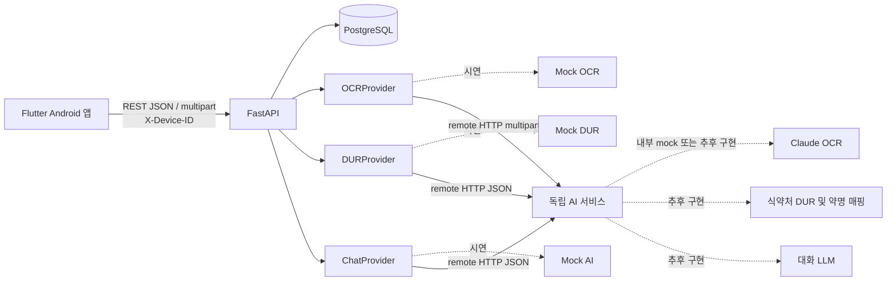

# BE 아키텍처

## 경계

- Flutter는 촬영, 마이크, STT, TTS를 담당합니다.
- 백엔드는 사용자 식별, 약·복약 데이터, DUR 결과, 채팅 세션과 텍스트 메시지를 담당합니다.
- 음성 파일은 백엔드로 전송하지 않습니다.
- 약봉투 이미지는 요청 처리 중 메모리에서만 사용하고 DB 또는 파일시스템에 저장하지 않습니다.
- 모든 외부 연동은 provider 인터페이스 뒤에 두며 `PROVIDER_MODE=mock`이 기본입니다.
- `remote`는 HTTP 어댑터를 사용합니다. AI 내부 모드는 별개이며 키 없이 AI mock으로 통합할 수 있습니다.
- Provider는 FastAPI dependency에서 설정에 따라 생성하고, import 시점의 전역 인스턴스를 사용하지 않습니다.
- OCR의 동기 HTTP 호출은 threadpool에서 실행해 FastAPI 이벤트 루프를 막지 않습니다.
- [통합 Compose 및 인수인계](server-integration.md)를 참고합니다.

## 실행 환경

- 1차 시연: Android 에뮬레이터 → `10.0.2.2:8090`
- 백엔드: FastAPI 단일 서비스
- DB: PostgreSQL
- 구성: Docker Compose
- DB 시각: UTC, 사용자 일정 기준: `Asia/Seoul`
