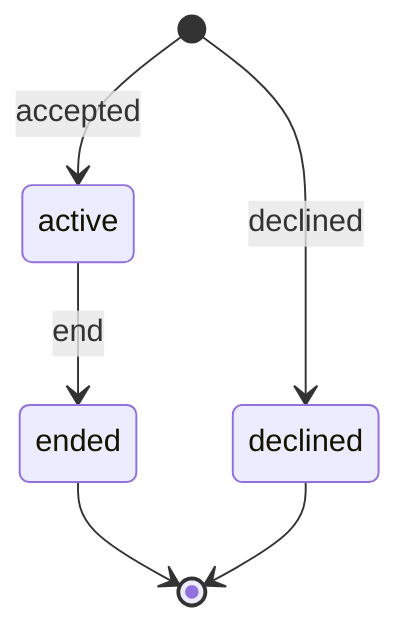

# 채팅 세션 계약

## 담당 경계

- Flutter: 누르고 말하기, STT, 인식 문장 표시, TTS
- Backend: 참여·거절 기록, 세션 상태, 텍스트 메시지 순서, AI 텍스트 응답
- 서버에 음성 파일을 보내지 않습니다.

## 상태

- 한 사용자에게 활성 세션은 하나만 존재합니다.
- 앱이 재시작되면 `GET /api/v1/chat/sessions/current`로 활성 세션을 복구합니다.
- `client_message_id`는 Flutter가 생성하며 네트워크 재전송 시 동일하게 유지합니다.
- 동일한 `client_message_id` 요청은 기존 사용자·AI 메시지 쌍을 반환합니다.
- AI 호출 실패는 `502 CHAT_PROVIDER_ERROR`입니다. 첫 인사 실패 시 세션을 생성하지 않고,
  일반 응답 실패 시 메시지·`user_message_count`·`last_activity_at` 변경을 롤백합니다.
  동일한 `client_message_id`와 본문으로 재시도할 수 있습니다.
- PostgreSQL에서 세션 생성은 사용자 행, 메시지 추가·종료는 세션 행을 잠가 직렬화합니다.
  AI 호출이 진행 중인 동시 재전송도 성공한 메시지 쌍을 한 번만 저장합니다.
  이미 저장된 중복 요청은 AI 호출 없이 반환합니다.
- 종료 요청은 멱등이며 종료된 세션에 새 메시지를 추가하면 `409 CHAT_SESSION_CLOSED`를 반환합니다.
- 시연 DB에는 텍스트만 임시 보관합니다. 음성은 보관하지 않으며 DB volume 초기화 시 원문도 삭제됩니다.

AI 요청은 `{opening, user_message_count, content}`뿐입니다.
이전 대화 `history` 전달 여부와 형식은 BE·AI의 **결정 필요 사항**이며 이번에는 추가하지 않았습니다.
실행 및 장애 검증은 [서버 통합 문서](server-integration.md)를 참고합니다.
