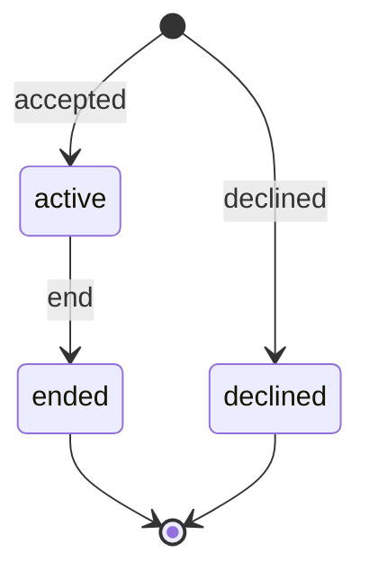

# 채팅 세션 계약

## 담당 경계

- Flutter: 누르고 말하기, STT, 인식 문장 표시, TTS
- Backend: 참여·거절 기록, 세션 상태, 텍스트 메시지 순서, AI 텍스트 응답
- 서버에 음성 파일을 보내지 않습니다.

## 상태

- 한 사용자에게 활성 세션은 하나만 존재합니다.
- 앱이 재시작되면 `GET /api/v1/chat/sessions/current`로 활성 세션을 복구합니다.
- `client_message_id`는 Flutter가 생성하며 네트워크 재전송 시 동일하게 유지합니다.
- 동일한 `client_message_id` 요청은 기존 사용자·AI 메시지 쌍을 반환합니다.
- 종료 요청은 멱등이며 종료된 세션에 새 메시지를 추가하면 `409 CHAT_SESSION_CLOSED`를 반환합니다.
- 시연 DB에는 텍스트만 임시 보관합니다. 음성은 보관하지 않으며 DB volume 초기화 시 원문도 삭제됩니다.

