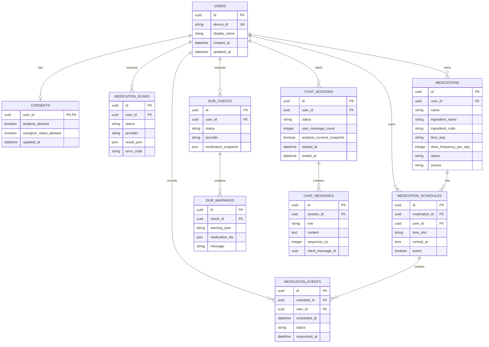

# ERD

```mermaid
erDiagram
  USERS ||--o| CONSENTS : has
  USERS ||--o{ MEDICATION_SCANS : requests
  USERS ||--o{ MEDICATIONS : owns
  USERS ||--o{ DUR_CHECKS : requests
  USERS ||--o{ MEDICATION_SCHEDULES : owns
  USERS ||--o{ MEDICATION_EVENTS : records
  USERS ||--o{ CHAT_SESSIONS : starts
  MEDICATIONS ||--o{ MEDICATION_SCHEDULES : has
  MEDICATION_SCHEDULES ||--o{ MEDICATION_EVENTS : creates
  DUR_CHECKS ||--o{ DUR_WARNINGS : contains
  CHAT_SESSIONS ||--o{ CHAT_MESSAGES : contains

  USERS {
    uuid id PK
    string device_id UK
    string display_name
    datetime created_at
    datetime updated_at
  }
  CONSENTS {
    uuid user_id PK,FK
    boolean analysis_allowed
    boolean caregiver_share_allowed
    datetime updated_at
  }
  MEDICATION_SCANS {
    uuid id PK
    uuid user_id FK
    string status
    string provider
    json result_json
    string error_code
  }
  MEDICATIONS {
    uuid id PK
    uuid user_id FK
    string name
    string ingredient_name
    string ingredient_code
    string item_seq
    integer dose_frequency_per_day
    string status
    string source
  }
  MEDICATION_SCHEDULES {
    uuid id PK
    uuid medication_id FK
    uuid user_id FK
    string time_slot
    time remind_at
    boolean active
  }
  MEDICATION_EVENTS {
    uuid id PK
    uuid schedule_id FK
    uuid user_id FK
    datetime scheduled_at
    string status
    datetime responded_at
  }
  DUR_CHECKS {
    uuid id PK
    uuid user_id FK
    string status
    string provider
    json medication_snapshot
  }
  DUR_WARNINGS {
    uuid id PK
    uuid check_id FK
    string warning_type
    json medication_ids
    string message
  }
  CHAT_SESSIONS {
    uuid id PK
    uuid user_id FK
    string status
    integer user_message_count
    boolean analysis_consent_snapshot
    datetime started_at
    datetime ended_at
  }
  CHAT_MESSAGES {
    uuid id PK
    uuid session_id FK
    string role
    text content
    integer sequence_no
    uuid client_message_id
  }
```

약 이름만 필수이며 성분명, 성분코드, 품목기준코드와 1일 복용 횟수는 선택값입니다. 복용 종료는 삭제 대신 `medications.status=ended`로 기록합니다.

